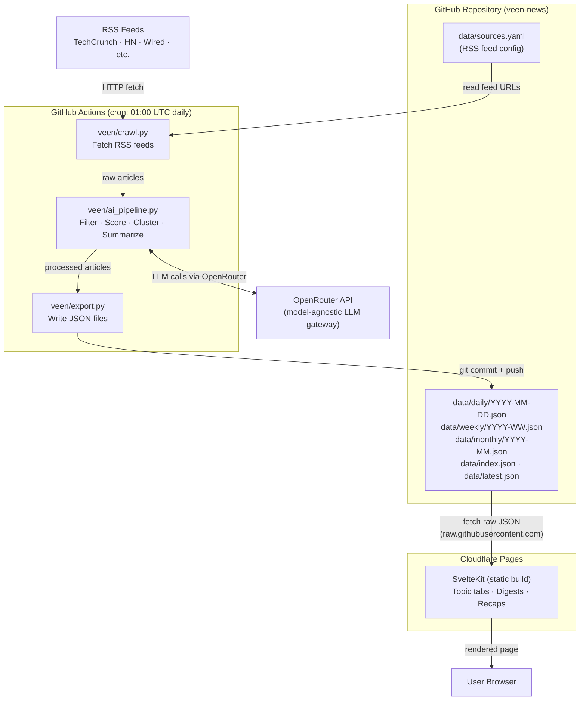

# Veen — Architecture Overview

## Executive Summary

Veen is a personal AI-powered news aggregator built entirely on free-tier infrastructure. GitHub Actions runs a Python crawler daily, fetches RSS/API sources, processes articles through an AI pipeline (OpenRouter), and commits the output as JSON files directly into this repository under `data/`. A SvelteKit frontend deployed on Cloudflare Pages fetches those JSON files from GitHub raw URLs — no backend server, no database, no Kubernetes cluster, no hosting cost.

The core insight is treating **Git as a database**: JSON files are versioned, diff-able, and served at zero cost via CDN (raw.githubusercontent.com or jsDelivr). GitHub Actions free tier provides 2000 min/month for private repos (unlimited for public) — a daily crawl job uses ~5–10 minutes. Total monthly infrastructure cost: **$0** (assuming low AI usage cost via cheap OpenRouter models).

---

## System Diagram



---

## Component Breakdown

| Component | Technology | Role |
|-----------|-----------|------|
| **Crawler** | Python + feedparser + httpx | Reads `sources.yaml`, fetches RSS feeds, deduplicates by URL |
| **AI Pipeline** | Python + openai SDK via OpenRouter | Filters clickbait, scores relevance, clusters stories, summarizes |
| **Export** | Python | Writes JSON files to `data/`, updates `index.json` and `latest.json` |
| **Compute** | GitHub Actions (cron) | Runs the pipeline daily at 01:00 UTC, commits output |
| **Data store** | JSON files in Git | Versioned article data, zero-cost CDN delivery |
| **Frontend** | SvelteKit (static export) | Reads JSON directly, renders topic tabs and recaps |
| **Frontend hosting** | Cloudflare Pages | Free CDN, auto-deploys on git push |
| **AI gateway** | OpenRouter | Model-agnostic LLM gateway; model controlled by `VEEN_AI_MODEL` env var |
| **Source config** | `data/sources.yaml` | Feed URLs and categories, git-managed, no admin UI |
| **Secrets** | GitHub Actions Secrets | `OPENROUTER_API_KEY` |

---

## Data Flow

### Stage 1 — Crawl
GitHub Actions triggers at 01:00 UTC. The crawler reads `data/sources.yaml`, fetches each RSS feed using `feedparser` and `httpx`, and deduplicates articles by exact URL match. Raw article objects collected: title, URL, published_at, source name, category.

### Stage 2 — AI Processing
The AI pipeline sends batches of article titles and snippets to OpenRouter. Four operations run in sequence:

```
AI Pipeline (OpenRouter)
├── Filter pass   → removes clickbait, spam, low-quality articles
├── Score pass    → scores articles 0.0–1.0 by topic relevance
├── Cluster pass  → groups semantically similar articles
└── Summarize     → generates 2–3 sentence summaries per cluster
```

1. **Filter** — mark clickbait, low-quality, and off-topic articles for removal
2. **Score** — assign a relevance score (0.0–1.0) per article per topic
3. **Cluster** — group articles covering the same event or story
4. **Summarize** — generate a 2–3 sentence summary per cluster

### Stage 3 — Commit
The export module writes processed articles to `data/daily/YYYY-MM-DD.json`, copies it to `data/latest.json`, and updates `data/index.json` (the master index of all available files). A `git diff --quiet` check skips the commit if nothing changed. Weekly and monthly recap files are generated by separate workflow triggers (Monday / 1st of month).

### Stage 4 — Serve
Cloudflare Pages hosts the SvelteKit static build. The frontend fetches `data/latest.json` or any historical daily/weekly/monthly file via `raw.githubusercontent.com` (or jsDelivr for CDN caching). No API server is involved — pure static JSON.

---

## Key Principles

| Principle | What it means |
|-----------|--------------|
| **Serverless** | No always-on process; compute runs only during the crawl window (~5–10 min/day) |
| **Git as database** | Article data lives in the repo; history, rollback, and diffing are free |
| **Static-first** | The frontend is a pre-built static site; no SSR, no Node server |
| **Zero infra ops** | No K8s, no VMs, no databases to maintain or pay for |
| **Model-agnostic AI** | OpenRouter routes to any model; swap via `VEEN_AI_MODEL` env var with no code changes |

---

## Trusted RSS Sources

### Technology
| Source | Feed URL |
|--------|----------|
| TechCrunch | `https://techcrunch.com/feed/` |
| The Verge | `https://www.theverge.com/rss/index.xml` |
| Ars Technica | `https://feeds.arstechnica.com/arstechnica/index` |
| Wired | `https://www.wired.com/feed/rss` |
| Hacker News (top) | `https://hnrss.org/frontpage` |
| Hacker News (quality) | `https://hnrss.org/newest?points=50` |

### AI
| Source | Feed URL |
|--------|----------|
| Hugging Face Blog | `https://huggingface.co/blog/feed.xml` |
| OpenAI Blog | `https://openai.com/blog/rss.xml` |
| Import AI (Jack Clark) | `https://importai.substack.com/feed` |
| The Gradient | `https://thegradient.pub/rss/` |

### DevOps / DevSecOps
| Source | Feed URL |
|--------|----------|
| The New Stack | `https://thenewstack.io/feed/` |
| DevOps.com | `https://devops.com/feed/` |
| HashiCorp Blog | `https://www.hashicorp.com/blog/feed.xml` |
| CNCF Blog | `https://www.cncf.io/feed/` |
| Kubernetes Blog | `https://kubernetes.io/feed.xml` |

### World
| Source | Feed URL |
|--------|----------|
| Reuters | `https://feeds.reuters.com/reuters/topNews` |
| AP News | `https://rsshub.app/apnews/topics/apf-topnews` |
| BBC World | `https://feeds.bbci.co.uk/news/world/rss.xml` |

### Vietnam
| Source | Feed URL |
|--------|----------|
| VnExpress International | `https://e.vnexpress.net/rss/news.rss` |
| Vietnam News | `https://vietnamnews.vn/rss/home.rss` |

### Innovations
| Source | Feed URL |
|--------|----------|
| MIT Technology Review | `https://www.technologyreview.com/feed/` |
| IEEE Spectrum | `https://spectrum.ieee.org/feeds/feed.rss` |
| Fast Company | `https://www.fastcompany.com/latest/rss` |

### Robotics
| Source | Feed URL |
|--------|----------|
| The Robot Report | `https://www.therobotreport.com/feed/` |
| IEEE Spectrum Robotics | `https://spectrum.ieee.org/feeds/blog/automaton.rss` |

### Open Source
| Source | Feed URL |
|--------|----------|
| GitHub Blog | `https://github.blog/feed/` |
| Linux Foundation Blog | `https://www.linuxfoundation.org/blog/feed` |
| FOSS Post | `https://fosspost.org/feed` |
| Opensource.com | `https://opensource.com/feed` |

---

## Related Documents

- [Tech Stack Decisions](tech-stack.md) — layer-by-layer decision table with rejected alternatives
- [GitHub Actions Workflow](github-actions-workflow.md) — workflow design and step breakdown
- [Data Model](data-model.md) — JSON schemas for all data files
- [Consuming the API](consuming-the-api.md) — how a third-party frontend can fetch and render this data
- [Roadmap](roadmap.md) — phased implementation plan
- ADRs: [001 Git-as-DB](adr/ADR-001-git-as-database.md) · [002 GH Actions](adr/ADR-002-github-actions-compute.md) · [003 AI Gateway](adr/ADR-003-ai-gateway.md) · [004 Static Frontend](adr/ADR-004-static-frontend.md) · [005 Source Config](adr/ADR-005-source-config.md) · [006 AI Agent Framework](adr/ADR-006-ai-agent-framework.md)
