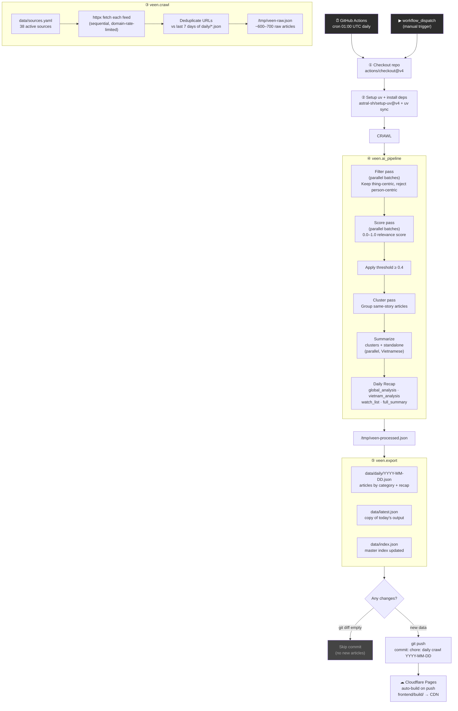
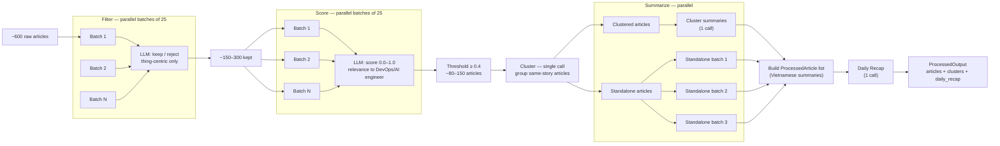
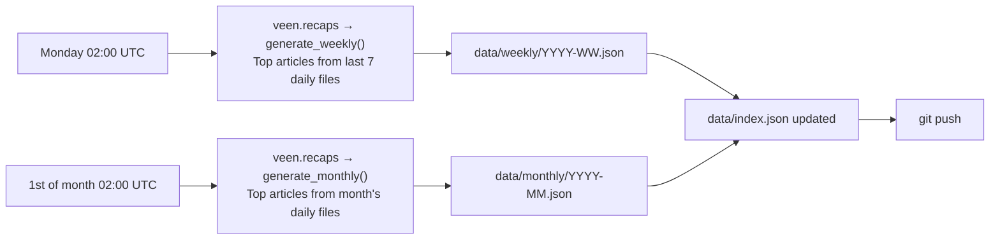
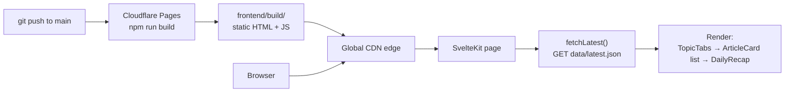

# Veen — Pipeline Flow

## System Overview



---

## AI Pipeline Detail



---

## Step Reference

| # | Step | Input | Output | Notes |
|---|------|-------|--------|-------|
| ① | Checkout | — | repo on disk | `GITHUB_TOKEN` for push-back |
| ② | Setup + install | `uv.lock` | `.venv/` | cached between runs |
| ③ | `veen.crawl` | `data/sources.yaml` | `/tmp/veen-raw.json` | 38 active sources, ~600–700 articles; 6 s delay between reddit.com requests |
| ④ | `veen.ai_pipeline` | `/tmp/veen-raw.json` | `/tmp/veen-processed.json` | model = `VEEN_AI_MODEL` env var |
| ⑤ | `veen.export` | `/tmp/veen-processed.json` | `data/daily/`, `data/latest.json`, `data/index.json` | |
| ⑥ | Commit & push | `data/` diff | git commit | skipped if no new data |
| ⑦ | Cloudflare Pages | git push event | static site deployed | automatic, no extra config |

---

## Weekly & Monthly Recaps

A separate workflow runs after the daily crawl to generate aggregate recaps.



**Workflow file**: `.github/workflows/recaps.yml`

---

## Data Flow: Frontend



`data/latest.json` is served directly from the repo as a static asset. No API server. No database.

---

## GitHub Secrets & Variables

| Name | Kind | Where set | Purpose |
|------|------|-----------|---------|
| `OPENROUTER_API_KEY` | Secret | Repo → Settings → Secrets | OpenRouter API key |
| `VEEN_AI_MODEL` | Variable | Repo → Settings → Variables | e.g. `deepseek/deepseek-v4-flash` |

**Variables** (not secrets) are visible in workflow logs — safe for non-sensitive config like provider names.

---

## Source Status

38 active sources across 8 categories. Sources disabled with reason:

| Source | Reason |
|--------|--------|
| Anthropic News | No public RSS feed |
| Meta AI Blog | No public RSS feed |
| AWS Blog | Request timeout |
| Netflix Tech Blog | Medium RSS timeout |
| GitLab Blog (old URL) | 404 — fixed to `about.gitlab.com/atom.xml` |
| VietnamNet | 404 — RSS URL changed |
| ICTnews | Redirects to HTML, no RSS |
| Vietnam News | Returns 0 articles |
| Reddit r/programming, r/ML, r/devops, etc. | 429 — Reddit allows only 1 RSS request per crawl run from server IPs; r/technology kept as the one working slot |

---

## Local Run

```bash
cp .env.example .env          # fill OPENROUTER_API_KEY
uv sync

uv run python -m veen.crawl        # → /tmp/veen-raw.json
uv run python -m veen.ai_pipeline  # → /tmp/veen-processed.json
uv run python -m veen.export       # → data/daily/, data/latest.json

# or all at once:
uv run python -m veen.pipeline
```
